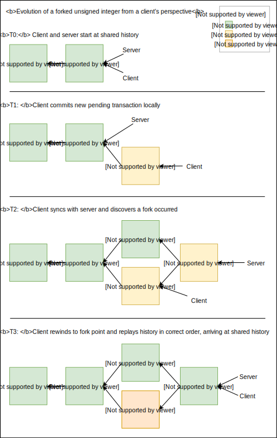
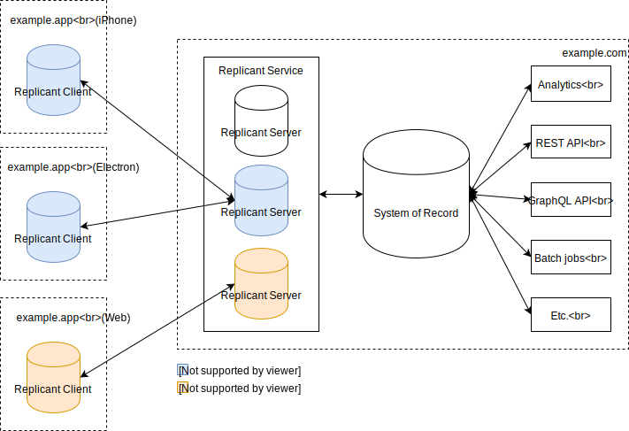
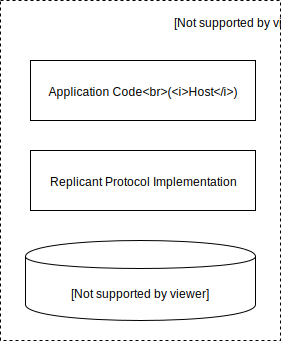

# Replicant: Spinner-Free Mobile Applications

"[Offline-First](https://www.google.com/search?q=offline+first)" describes an application architecture where
data is read and written from a local database on user devices, then synchronized lazily with servers whenever
there is connectivity.

These applications are highly desired by product teams and users because they are so much more responsive and
reliable than applications that are directly dependent upon servers. By using a local database as a buffer, offline-first
applications are instantaneously responsive and reliable in any network conditions.

Unfortunately, offline-first applications are also really hard to build. Bidirectional
sync is a famously difficult problem, and one which has elluded satisfying general
solutions. Existing attempts to build general solutions (Apple CloudKit, Android Sync, Google FireStore, Realm, PouchDB) all have one or more of the following serious problems:

* **Manual Conflict Resolution.** Consult the [Android Sync](http://www.androiddocs.com/training/cloudsave/conflict-res.html) or [PouchDB](https://pouchdb.com/guides/conflicts.html) docs for a taste of how difficult this is for even simple cases. Every single pair of operations in the application must be considered for conflicts, and the resulting conflict resolution code needs to be kept up to date as the application evolves. Developers are also responsible for ensuring the resulting merge is equivalent on all devices, otherwise the application ends up [split-brained](https://en.wikipedia.org/wiki/Split-brain_(computing)).
* **Lack of Atomic Transactions.** Some solutions claim automatic conflict resolution, but lack atomic transactions. Without transactions, automatic merge means that any two sequences of writes might interleave. This is analogous to multithreaded programming without locks.
* **Restrictive Data Models.** Some solutions achieve automatic conflict resolution with restrictive data models, for example, by only providing acccess to [CRDTs](https://en.wikipedia.org/wiki/Conflict-free_replicated_data_type). However only a relatively small number of CRDTs are known. Developers must twist their data model to fit those types. For example, Realm has a special [Counter](https://realm.io/docs/java/latest/#field-types) type that merges concurrent changes by summing them. But if you want to implement something very similar - a high score in a game, or an inventory count that can't go below zero - there is no way easy way to do that in Realm because there is no special `MaxNum` or `PositiveOnlyCounter` type built into Realm.
* **Difficult or non-existent incremental integration.** Some solutions effectively require a full committment to a non-standard or proprietary backend database or system design, which is not tractable for existing systems, and risky even for new systems.

For these reasons, existing products are often not practical options for application developers, leaving them
forced to develop their own sync protocol at the application layer if they want an offline-first app. Given how expensive and risky this is, most applications delay offline-first until the business is very large and successful.

# Introducing Replicant

Replicant dramatically reduces the difficulty of building offline-first mobile applications.

The key features that contribute to Replicant's leap in usability are:

* **Transactions**: Replicant supports full [ACID](https://en.wikipedia.org/wiki/ACID_(computer_science)) multikey read/write 
transactions. Transactions in Replicant are expressed as arbitrary functions, which are executed serially and isolated from 
each other.
* **Conflict-free**: Replicant is "[Strongly Eventually Consistent](https://en.wikipedia.org/wiki/Eventual_consistency#Strong_eventual_consistency)"): all nodes are guaranteed to arrive at the same state once all transactions have been synced. This feature, combined with atomic transactions,
means that developers typically do not need to think about the fact that nodes are disconnected. They simply use 
the database as if it was a local database and synchronization happens behind the scenes.
* **Standard Data Model**: The Replicant data model is a standard document database. From an API perspective, it's
very similar to Google Cloud Firestore, MongoDB, Couchbase, FaunaDB, and many others. You don't need to learn anything new, 
and can build arbitrarily complex data structures on this primitive that are still conflict-free.
* **Easy to Adopt**: Replicant is designed to integrate incrementally into existing systems, not take them over.

# Intuition

*TODO: Maybe remove this section or reduce and merge with below*

Replicant is heavily inspired by [Calvin](http://cs.yale.edu/homes/thomson/publications/calvin-sigmod12.pdf).

The key insight in Calvin is that the problem of ordering transactions can be separated from the problem of
executing transactions. As long as transactions are pure functions, and all nodes agree to an ordering, and
the database is a deterministic, then execution can be performed coordination-free by each node independently.

This insight is used by Calvin to create a high-throughput, strictly serialized distributed database without the need
for physical clocks. Calvin nodes coordinate synchronously only to establish transaction order, then run their
transactions locally.

In Replicant, we turn the knob further: As in Calvin, Replicant transactions are pure functions in a
fully-featured programming language. But unlike Calvin, nodes do not coordinate synchronously to establish order,
or for any other reason. Instead nodes execute transactions completely locally, responding immediately to the calling
application. A log is maintained at each node of the local order transactions occurred in. Asynchronously, when
connectivity allows, "client nodes" (those running the user interface) synchronize their logs with a special (logical)
node called the "Replicant Server", which decides authoratively what the total order is. The resulting totally ordered 
transaction log is then replicated back to each client node.

This will commonly result in a client node learning about transactions that occurred "in the past" from its
point of view (because they happened concurrently on other nodes) after synchronizing with the server. In that case,
the client rewinds its database back to the point of divergence and replays the transactions in the correct order.

Thus, once all nodes have the same log, they will execute the same sequence of transactions and are guaranteed to arrive at 
the same database state.

The key promise that Replicant makes is that once synchronization is complete, all nodes will have the same transaction 
history and the exact same state. There is no transaction that any node can perform that will stop this from happening. This 
is a powerful invariant to build on that makes reasoning about a disconnected system much easier. As we will see it also
means that most types of what are commonly called "merge conflicts" just go away, and those that remain are much easier
to handle.

# Processing Model



Replicant builds on [Noms](https://github.com/attic-labs/noms), a versioned, transactional, forkable database.

Noms has a data model that is very similar to Git and related systems: Each change to the system is represented by a _commit_ object that contains an immutable snapshot of the system as of that change. The previous change (or changes, in the case where a fork is merged) is referenced by a set of _parents_. As with Git, Noms makes use of content-addressing and persistent data structures to reduce duplication and facilitate fast diff and sync.

The main difference between Noms and Git is that Git stores mainly text and is intended to
be used by humans, while Noms stores mainly data structures, and is intended to be used by software. But you could actually build Replicant with Git instead of Noms -- it would just be a lot slower and harder.

Replicant builds on the Noms data model by annotating each commit with the transaction function and parameters that created 
it. Since transactions are pure functions, this means that any node, can execute a commit's transaction against its parent 
commit and arrive at the exact same commit.

A Replicant _client_ (a mobile app embedding the Replicant client library) moves forward by executing transactions
that create new commits, and appending each new commit to its local log.

Periodically, the client will _synchronize_ with its server, sending its novel commits to the server, and getting the latest 
updates to the totally ordered transaction set in return.

When this happens, the client will frequently see that there were transactions that happened in parallel on other nodes. In this case, the client rewinds to the point of divergence and replays the transactions in the correct order according to the log.

## Noms Schema

These schema are written in [NomDL](https://github.com/attic-labs/noms/blob/master/go/nomdl/parser.go#L82), the type definition language for Noms. You don't need to know Noms in detail to be able to follow along.

### Normal Commit

This is the basic commit in Replicant that records a transaction having been run. To replay this transaction, execute the
transaction specified by `.meta.tx` against the single parent commit, if any.

```
struct Commit {
  meta struct {
    // The date that the commit was started on the origin.
    // This is the date that is returned for any call to the current time in the transaction on any node.
    // Random sources are also seeded from this.
    date Date
    // The details of the transaction that was executed and led to this commit
    tx struct {
      // Identifies the node the transaction was originally run on - useful for debugging
      Origin String
      // The bundle of code that contains the transaction function that was run
      Code Ref<Blob>
      // The name of the transaction function within `Code` that was run
      Name String
      // The arguments that were passed to the transaction function
      Args List<Value>
    }
  }
  // The previous commit. For Replicant "normal" commits, this will always be empty or size=1
  parents Set<Ref<Cycle<Commit>>>
  // The current state of the database
  value struct {
    // The currently registered transactions - see "registering transactions"
    TxReg Ref<Set<Ref<Blob>>>
    // All user data, maped by unique ID
    Data Map<String, Value>
  }
}
```

TODO: Also need indexes somewhere. It's a bit tricky because they will *not* be synchronized, and might even be
device specific, but ideally they move atomically with commits. Seems like they really need to be in another
dataset and something else ensures they happen atomically with commit :-/.

### Merge Commit

This commit records a fork in history being merged back together. `.parents` will always have two commits, and
one of them will also be in `.meta.first`. To replay this transaction, first replay the commit at `.meta.first`,
then replay the other commit in `parents`.

```
struct Commit {
  meta struct {
    first Ref<Cycle<Commit>>
  }
  parents Set<Ref<Cycle<Commit>>>
  value struct {
    TxReg Ref<Set<Ref<Blob>>>
    Data Map<String, Value>
  }
}
```

### Failed Commit

This commit records a transaction that failed server-side validation (see "integration"). `.parents` has either
zero or one entries, which is the commit that the failed commit would have been ordered after, had it succeeded.
The `.meta.failed` field contains the commit that failed validation.

To replay this transaction, do nothing. The data in `.value` should be identical to the data in the parent commit,
if any.

```
struct Commit {
  meta struct {
    failed Ref<Cycle<Commit>>
  }
  parents Set<Ref<Cycle<Commit>>>
  value struct {
    TxReg Ref<Set<Ref<Blob>>>
    Data Map<String, Value>
  }
}
```

# System Architecture

A deployed system of replicant nodes is called a *Replicant Group* and consists of a single logical *Replicant Server* and one or more *Replicant Clients*. Replicant Clients are typically mobile apps running in iOS or Android, but traditional desktop apps and web apps could also be clients, or really any software that embeds the Replicant Client library.

<p align="center">
  
</p>

Typically each Replicant Group models data for a single user of a service across all the user's devices. But a Replicant Group could be more fine-grained (if, for example, it's desirable to replicate a different subset of data to different device types) or more coarse-grained (if there are groups of users collaborating on the same dataset).

One or more Replicant Servers are run by the Replicant Service. The Replicant Service is run alongside the application's existing server stack and database of record. Plumbing is added to route relevant updates from the database of record to Replicant Servers and the reverse (see "integration"). The Replicant Service can also be relied on as an external service, at http://replicant.io.

# Replicant Client



A Replicant Client is embedded within a client-side application, typically a mobile app in iOS or Android, but also potentially a desktop or web app. The application, or _host_, uses the client as its local datastore.

The client is updated by executing _transactions_, which are invocations of pure functions called _transaction functions_. Each _transaction function_ takes one or more parameters, plus a snapshot of the current state of the database, and returns as a result a new state of the database.

## Client State

Replicant maintains two Noms _datasets_ (analagous to Git branches):

* _remote_ - the last-known state of the Replicant Server
* _local_ - the current state exposed to the host application

Each dataset is either empty or has one of the Replicant `Commit` types (see "Processing Model").

## Data Model

The data model exposed to user code is a fairly standard document database approach, like Google Firestore, Couchbase, RethinkDB, etc:

- keys are byte arrays
- values are JSON-like trees, except:
  - special _class field supported to give json objects a "type", which type that they can later be queried by
  - special _id field for unqiue id
  - blobs supported
- you can query into a subtree of a value using a path syntax
- you can optionally declare indexes on any path

** TODO:** *This needs a lot more work. I haven't thought a lot about it because it's not relevant to the core problem Replicant is solving, only the developer ergonomics (which is also important! but can be done a bit later).*

## Transaction Language

The key desired features for the transaction language are:

* *Determinism*: Every invocation with the same database state and parameters must result in the same output
and effect on the database, on all platforms Replicant runs on.
* *Popularity*: Replicant cannot be easy to use if it requires you to learn a new programming language. Also
popularity on each target platform needs to be considered. For example, Matlab is popular, but it's not popular
with Android or iOS developers.

I am currently thinking that the initial transaction language should be JavaScript. Determinism *could* be **enforced** a variety of ways:

* Using an approach like [deterministic.js](https://deterministic.js.org/) - this is a blacklist approach, and so it's guaranteed to miss things
* Running a JavaScript interpreter inside [wasmi](https://github.com/paritytech/wasmi) - this is a whitelist approach that was built from the ground-up for determinism, but it's slow
* Running inside a forked [Otto](https://github.com/robertkrimen/otto) that enforced determinism - also slow

I think that we do not need determinism to be rock-solid because we will detect non-deterministic transactions automatically during sync. All we need to do is make non-deterministic transactions hard to trigger by accident, and the deterministic.js approach is sufficient for that while allowing us to use a modern JIT'd VM for performance.

## Invoking Transactions

Since transaction code is stored in the database and synchronized with other data, invoking transactions is simply running the relevant function and writing an appropriate commit to Noms referencing the code.

It might look something like this (in Java):

```java
// Writes the code from "transactions.js.bundle" included in the app to the DB if not present
Transactions txs = replicant.LoadTransactions("transactions.js.bundle");

// Execute "createUser" from the bundle and write the transaction to the database
ReplicantResult result = txs.exec("createUser", newUserName, newUserEmailAddress);
```

However, we expect that in the typical case, applications will want to pre-register transaction code on the server-side for efficiency. See "registering transactions" for more.

# Replicant Server

Structurally, a Replicant Server is very similar to a client. It contains a Noms database and executes transactions in the same way.

However, its role in the system is different: a Replicant Server's main responsibility is to maintain the authorative history of transactions that have occurred for a particular Replicant Group and their results.

Unlike clients, Replicant Servers do not ever rewind. The server is Truth, and the clients dance to its tune. Once a transaction is accepted by a server and written to its history, by either clients or the server itself, it is final, and clients will rewind and replay as necessary to match.

This does not mean, however, that servers have to accept whatever clients write. Servers have full discretion over whether to accept any given transaction, and they validate all work clients do. See "synchronization" and "integration" for details.

## Noms Schema

The same as the client, except there's only a `local` dataset, since the server doesn't need to allow a separate branch to evolve while sync is in progress the way the client does.

## Registering Transactions

We expect that users will typically want to *register* transaction functions at the server-side, rather than let clients execute whatever transactions they want, for a few reasons:

1. Without this, clients would have to include the code in their packages, and then write it into their databases, which would double the amount of storage the clients would consume.
2. We expect that developers will usually want to whitelist transaction functions that can run, based on known hashes of code bundles. Otherwise, malicious clients could attack good clients by way or the sync protocol.
3. For many transaction types originating on clients, there will be server-side actions that need to happen -- either to actually execute the transaction in reality, or to validate the transaction. It's natural to integrate these handlers at the point of registration.

This is implemented as a special pair of transaction functions baked into all Replicant nodes: `registerTransaction` and `unregisterTransaction` that update the `value.txCode` field of the server's `local` dataset. Since these transaction functions could never be themselves registered, they will always fail validation during sync and thus will not be allowed to be called by clients (see Synchronization).

## Consistency Requirements

Each Replicant Server acts as a single strictly serialized logical database, even though they are typically a distributed system internally. In the event of a partition internal to the replicant server, it ceases to be available rather than give inconsistent results. This has no effect on client availability or performance, since interaction with the server is in the background as connectivity allows.

# Replicant Service

The Replicant Service is a horizontally scalable application server server written in Go that runs one or more Replicant servers. All state is stored persistently in S3/Dynamo (see [NBS-on-AWS](https://github.com/attic-labs/noms/blob/master/go/nbs/NBS-on-AWS.md)).

Because Replicant Servers store a small amount of data (that is, just the data that should be replicated to user devices), there is no need to shard the data of a single Replicant Server across multiple instances of the service. However, it may be the case that for a variety of reasons there are multiple instances of the service hosting the same Replicant Server at once.

Each NBS instance has its own isolated backing storage, meaning that for some applications, the Replicant Service might end
up duplicating a lot of data server-side in separate Replicant Servers. To combat that, Replicant Service could be setup to
share a single NBS instance across all users. The downside (in the current code) is that all commits to NBS serialized. This
would probably still be fine up to lots of users, but at some point would need to be fixed.

## Integration

Most Replicant Groups will not be self-contained. Creating and synchronizing data amongst themselves it not enough: they must
interact with the outside world -- either with other existing parts of the service stack, or with other replicant groups. Myriad examples include sending emails, billing customers, sending data to and from other users on the same service, updating and reflecting updates to the system of record, etc.

Connecting a Replicant Group with the outside world is called _Integration_.

The Replicant Service exposes the following conceptual API (represnted here as Go pseudo-code, but in reality available as
either REST or via a Golang API) to update a Replicant Group:

```Go
type ReplicantService interface {
  // Executes a replicant transaction
  Execute(origin string, code hash.Hash, funcName string, args []types.Value)

  // Specifies a service to handle the specified transaction functions. "Handling" means that for each transaction with
  // one of the specified names, the service will be invoked 
  SetHandler(funcNames []string, handler *url.URL)
}

type ReplicantHandler interface {
  // Invoked synchronously for each transaction matching the previous call to SetHandler().
  // If returns false, then Replicant will replace the specified transaction with a FailureCommit in the history.
  // Handle() will keep getting called until it returns either true or false (replicant tracks whether it has received an 
  // answer for each transaction and doesn't proceed until it does). So this should do minimum validation to get to the point
  // where it can definitely proceed, then return to Replicant.
  Handle(replicantServer *url.URL, commit hash.Hash) bool
```

## API

For each Replicant Server, the Replicant Service exposes:
* The Transaction Registration API
* The Integration API above
* The [Noms Remote Server API](https://github.com/attic-labs/noms/blob/master/go/datas/database_server.go#L64) (except that `PostRoot()` is non-public)
* The `Commit(newHead hash.Hash)` method - see "Synchronization" for details

# Synchronization

Synchronization is a three-part process that should feel very similar to anyone who has looked under the covers at Git. However, it takes advantage of the ability of the server to replay transactions and create merges on behalf of clients to reduce the entire process to just one logical round trip (under the cover, lots of HTTP transactions are happening).

## Step 1: Client pushes to server

The client uses (effectively) [`noms sync`](https://github.com/attic-labs/noms/blob/master/doc/cli-tour.md#noms-sync) to push all missing chunks from the client's `local` dataset to the server's `local` dataset. At the end of the push, the client calls `Commit(newHead hash.Hash)`.

## Step 2: Commit on the server

On the server-side, `Commit(newHead)` looks like:

1. The call is queued behind any other commit to the same Replicant Server. Since Replicant Groups are usually small numbers of nodes, this will typically be a very short wait.
2. When the call continues:
  - Find the fork point between the client's commit and the server's latest commit
  - If the server commit is a fast-forward from client:
    - Respond with the new head, there's nothing more to do
  - Else:
    - Validate each new commit (each commit after the fork point on the client side):
      - Check that the specified transaction codebase is registered (exists in .value.txCode) and the function is known
      - Execute the transaction
      - If the resulting hash doesn't match the one the client specified, the client is badly behaved, return 40x (see badly-behaved clients)
      - If the transaction has server-side validation registered, run that validation (see integration)
        - If the validation fails, replace the transaction with a CommitFailure transaction (see server-side validation)
      - Commit the new head
      - If the client commit is a fast-forward of the validated transaction chain:
        - Return the new head
      - Else:
        - Add a merge commit referencing the two branches and indicating which one goes first (see merge commits)

## Step 3: Client-Side Pull

Back on the client-side, the `Commit()` call has just returned with a new head that should become the head of the `remote` dataset. This is trival. We trust the server and this makes no changes to our local state, so we just `noms sync` the server's `local` dataset to our `remote` dataset, which pulls all the relevant chunks and we're done.

## Step 4: Client-Side Rebase

We want to enable clients to make local progress between Step 1 and Step 3. Otherwise apps will be stalled waiting for syncs that may take awhile, or even stall in the face of flaky networks.

Therefore we allow the `local` dataset to evolve as normal while the sync is in progress.

As a result, after step 3 finishes, we may have some new commits in the `local` dataset since when step 1 started. We must rebase these commits:

- Find fork point between `remote` and `local` heads
- If local is ff of remote (no other client submitted work in meantime)
  - nothing to do
- If remote dataset is ff of local (no local work happened in meantime):
  - Set local to remote
- Else:
  - Rebase each new commit from local fork onto `remote` head
  - Commit result to `local`

# Conflicts

And now, after an immense amount of setup, we can circle back around to where we started.

Let's talk about conflicts.

There are a lot of different things that people mean when they say "conflicts". Let's go through some of them:

## Case that work nicely

### A single read-write register based on user data

Example:

```js
function setStatus(present, status, emoji) {
  db.set({
    _id: 'status'
    present,
    status,
    emoji,
  });
}
```

In this example, a transaction takes data from the user and sets the user's current away status. If this runs concurrently at two sites, there is no way to merge them. One must win, or we must ask the user.

In this case, it clearly doesn't matter which one wins and isn't worth the user. The system must just choose one consistently. This is naturally solved by running transactions serially in a consistent order on all nodes.

### Multiple register writes

```js
function moveKanbanCard(cardID, fromColumnID, toColumnID) {
  const fromColumn = db.get(fromColumnID);
  const toColumn = db.get(toColumnID);
  fromColumn.items = fromColumns.items.splice(fromColumns.items.findIndex(c => c._id == cardID));
  toColumns.items.push(cardID);
  db.set(fromColumn);
  db.set(toColumn);
}
```

In this example, we modify two data items. Each write only makes sense if the other write succeeds. We need the card to end
up in either one row or the other.

This example is difficult to achieve reliably in existing solutions that use simple last-write-wins semantics because there is no easy way to guarantee that the two writes only happen together.

### Arithmetic

```js
funtion updateHighScore(newScore) {
  const highScore = db.get('high-score');
  highScore.value = Math.max(highScore.value, newScore);
  db.set(highScore);
}
```

In this example, we perform some simple arithmetic on a register. Again, this is naturally handled by enforcing a consistent serial order on transactions, and is not easy to solve with standard CRDTs or LWW semantics.

Another common example of this class of conflict include a number that can't go negative (number of items in stock), or counters.

### Accumulation

```js
function addTodo(text) {
  const list = db.get('todos');
  list.value.append(text);
  db.set(list);
}
```

This example appends an item to a list. This would not work in a LWW system (though it would work with sequence CRDTs).

### Data structure maintenance

```js
function insert(db, text) {
  const val = db.get('index');
  val.sorted = val.sorted || [];
  let idx = val.sorted.findIndex(v => v > text);
  if (idx == -1) {
    idx = val.sorted.length;
  }
  val.sorted.splice(idx, 0, text);
  db.set(val);
}
```

This example maintains a sorted list for fast searching. This cannot be done easily in either a LWW system or with CRDTs, yet it is resolved completely naturally here.

This applies to all kinds of complex data structures like geoindices, text indices, etc.

## Cases that do not work automatically

### Arbitrary sequence manipulation

Arbitrary sequence manipulation is not nicely addressed by Replicant as proposed above:

```js
function moveTodoItem(itemID, newIdx) {
  const list = db.get('todos');
  const currIdx = list.value.findIndex(item => item._id == itemID);
  if (currIdx == newIdx) {
    return;
  }
  if (currIdx < newIdx) {
    newIdx--;
  }
  const item = list.splice(currIdx, 1);
  list.splice(newIdx, 0, item);
}
```

Many cases, including the above, can be made to work by changing the parameters of the function such that more is done inside the transaction (in this case: finding the insert position). However, other more complex cases don't naturally work.

One way to improve Replicant to support these cases better would be to change the Noms `List` type to be backed by a sequence CRDT. It would not change the allowed operations, users would not even have to know the implementation details.

### Asking the user

Replicant addresses the majority of merge cases quite naturally, but there are still bound to be the occasional reason to
ask the user to merge a conflict.

Such cases can naturally be located after merge has occurred by finding the merge commits and then applying a new transaction
that performs whatever fixup the user specified.

# Other Ideas

## Host-Proof Hosting

One challenge with the system as proposed is that customers must either run the Replicant Service inside their datacenter and 
take on the ops burden for that, or else rely on replicant.io. This latter case is tempting, but means that replicant.io
will see the customer's user data.

A solution to this problem would be change the Replicant Service to store only an ordered log of transaction functions and
arguments, not the actual data. This moves the work of merging transactions to the client, probably slowing down sync. However 
the advantage would be that the log can be encrypted using a key that only the client knows, dramatically improving privacy
and security from the customer's point of view.

# Other Applications

## Low-Latency/Edge Database

The same basic design presented here can be used as a classic distributed transactional database. Such a database would have
the interesting property of near-instant transactional commit to a "pending status", with delayed finality. This is sort of
like the classic strategy of combining a queue with a transactional database to reduce latency. However, it has the twist
that once something is put on the queue, the database is queryable as normal including the pending data.

One special case of this would be to run the database in CDNs, very close to end-users. This would give applications an
extremely low latency "transactional" database, with delayed finalization.

## P2P Database

I think that consensus can also be determined in a purely peer-to-peer mode with no authoritative server. This would be
interesting for peer-to-peer applications, if those ever take off.
