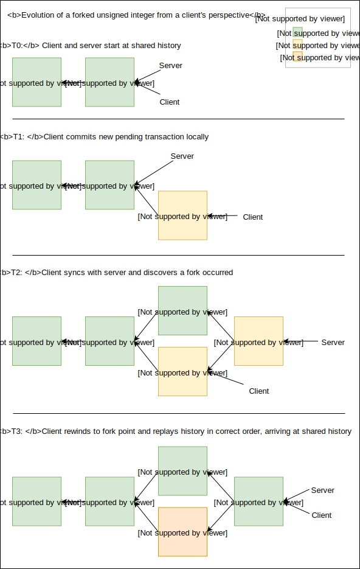
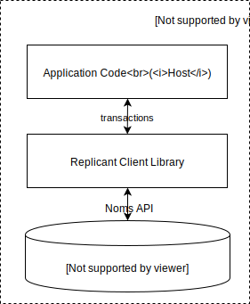

# Table of Contents

* [Spinner-Free Mobile Applications](#offline-first-spinner-free-mobile-applications)
* [Introducing Replicant](#introducing-replicant)
* [Intuition](#intuition)
* [Data Model](#data-model)
* [System Architecture](#system-architecture)
* [Replicant Client](#replicant-client)
* [Replicant Server](#replicant-server)
* [Replicant Service](#replicant-service)
* [Synchronization](#synchronization)
* [Conflicts](#conflicts)
* [Other Ideas](#other-ideas)

# Offline-First: Spinner-Free Mobile Applications

"[Offline-First](https://www.google.com/search?q=offline+first)" describes a client/server architecture where
the application reads and writes to a local database on the device, and synchornizes with servers asynchronously whenever
there is connectivity.

These applications are highly desired by product teams and users because they are so much more responsive and
reliable than applications that are directly dependent upon servers. By using a local database as a buffer, offline-first
applications are instantaneously responsive and reliable in any network conditions.

Unfortunately, offline-first applications are also really hard to build. Bidirectional
sync is a famously difficult problem, and one which has elluded satisfying general
solutions. Existing attempts to build general solutions (Apple CloudKit, Android Sync, Google Cloud Firestore, Realm, PouchDB) all have one or more of the following serious problems:

* **Manual Conflict Resolution.** Consult the [Android Sync](http://www.androiddocs.com/training/cloudsave/conflict-res.html) or [PouchDB](https://pouchdb.com/guides/conflicts.html) docs for a taste of how difficult this is for even simple cases. Every single pair of operations in the application must be considered for conflicts, and the resulting conflict resolution code needs to be kept up to date as the application evolves. Developers are also responsible for ensuring the resulting merge is equivalent on all devices, otherwise the application ends up [split-brained](https://en.wikipedia.org/wiki/Split-brain_(computing)).
* **Lack of Atomic Transactions.** Some solutions claim automatic conflict resolution, but lack atomic transactions. Without transactions, automatic merge means that any two sequences of writes might interleave. This is analogous to multithreaded programming without locks.
* **Restrictive Data Models.** Some solutions achieve automatic conflict resolution with restrictive data models, for example, by only providing acccess to [CRDTs](https://en.wikipedia.org/wiki/Conflict-free_replicated_data_type). However only a relatively small number of CRDTs are known. Developers must twist their data model to fit those types. For example, Realm has a special [Counter](https://realm.io/docs/java/latest/api/io/realm/MutableRealmInteger.html) type that merges concurrent changes by summing them. But if you want to implement something very similar - a high score in a game, or an inventory count that can't go below zero - there is no way easy way to do that in Realm because there is no special `MaxNum` or `PositiveOnlyCounter` type built into Realm.
* **Difficult or non-existent incremental integration.** Some solutions effectively require a full committment to a non-standard or proprietary backend database or system design, which is not tractable for existing systems, and risky even for new systems.

For these reasons, existing products are often not practical options for application developers, leaving them
forced to develop their own sync protocol at the application layer if they want an offline-first app. Given how expensive and risky this is, most applications delay offline-first until the business is very large and successful. Even then, many attempts fail.

# Introducing Replicant

Replicant dramatically reduces the difficulty of building offline-first mobile applications.

The key features that contribute to Replicant's leap in usability are:

* **Transactions**: Replicant supports full [ACID](https://en.wikipedia.org/wiki/ACID_(computer_science)) multikey read/write 
transactions. Transactions in Replicant are expressed as arbitrary functions, which are executed serially and isolated from 
each other.
* **Virtually Conflict-free**: Replicant is a [Convergent Causal Consistent](https://jepsen.io/consistency/models/causal) system: after synchronization, transactions are guaranteed to have run in the same order on all nodes, resulting in the same database state. This feature, combined with transaction atomicity,
means that developers rarely need to think about conflicts. Conflicts do still happen, but in almost all cases conflict resolution is a natural side-effect of serialized atomic transactions.
* **Standard Data Model**: The Replicant data model is a standard document database. From an API perspective, it's
very similar to Google Cloud Firestore, MongoDB, Couchbase, FaunaDB, and many others. You don't need to learn anything new, 
and can build arbitrarily complex data structures on this primitive that are still conflict-free.
* **Easy to Adopt**: Replicant is a simple primitive that runs along side any existing stack. Its only job is to provide bidirectional conflict-free sync between clients and servers. This makes it very easy to adopt: you can try it for just a small piece of functionality, or a small slice of users, while leaving the rest of your application the same.

# Intuition



Replicant is heavily inspired by [Calvin](http://cs.yale.edu/homes/thomson/publications/calvin-sigmod12.pdf), a high-throughput, strictly serialized, transactional distributed database.

The key insight in Calvin is that the problem of *ordering* transactions can be separated from the problem of
*executing* transactions. As long as transactions are pure functions, and all nodes agree to an ordering, and
the database is a deterministic, then execution can be performed coordination-free by each node independently.

In Replicant, we turn the knob further: As in Calvin, Replicant transactions are pure functions in a
fully-featured programming language. Unlike Calvin, nodes do not coordinate synchronously to establish order,
or for any other reason. Instead nodes execute transactions completely locally, responding immediately to the calling
application. A log is maintained at each node containing the local history of transactions. Asynchronously, when
connectivity allows, nodes synchronize their logs with an authoritative service to arrive at a single linear history.

This will commonly result in a client node learning about transactions that occurred "in the past" from its
perspective. In that case,
the client rewinds its state back to the point of divergence and replays the transactions in the correct order.

<hr>

***The key promise that Replicant makes is that all transactions will execute atomically, in the exact same order, with the exact same results, on all nodes. There is no transaction that any node can execute which will stop this from happening.***

This is a powerful invariant to build on that makes reasoning about disconnected systems much easier. As we will see, it also
means that most types of what are commonly called "merge conflicts" just go away, and those that remain become easier 
to handle correctly.

# Data Model

Replicant's internal data model is very similar to Git and related system:

Each change to the database is represented by a _commit_ object that contains an immutable snapshot of the entire database as of that moment. Commits are identified using a cryptographic _hash_ of their serialization. Each commit also includes the hash of the previous commit (or commits, in the case of a merge), so that the entire history of a database is uniquely identified by a single hash. As in Git, Replicant nodes also contain one or more named _heads_, which are the only mutable state in the entire system. Each head contains the hash of a commit.

TODO: Diagram

Just like Git, Replicant makes extensive use of content-addressing and persistent data structures internally to avoid duplicating the entire database in each commmit. (For much more information on this, see [Noms](https://github.com/attic-labs/noms), which is the library Replicant uses internally for this functionality.)

Unlike Git, a Replicant commit also includes a record of the exact function and parameters that created 
it. Since transactions are pure functions, this means that two nodes that start at the same state and execute the same function with the same parameters will create the exact same commit, with the same hash.

A Replicant client progresses by executing a JavaScript function against the current state of one of its heads. The function that was executed, including its parameters and all dependent code, are recorded in the new commit, along with the references to the previous commit(s). The hash of the new commit is then atomically written to the head.

Periodically, the client _synchronizes_ with its server, sending its latest local commits, receiving the rest of the merged history in exchange, and integrating it into its local state. See "Synchronization" for details.

## Schema

There are a handful of different commit _types_ used in Replicant. In Go/C++ -ish pseudocode, they are as follows:

```
type Commit = GenesisCommit | TxCommit | RebaseCommit | RejectCommit
```

### Genesis Commit

TODO: diagram

The Genesis commit is the initial commit in every Replicant database. It has no metadata, no basis, and always has an empty bundle and empty user data. Since every Replicant database starts with this commit, it is always possible to find at least one shared ancestor - the genesis commit - for any two Replicant database states.

```
type CommitValue struct {
  Value struct {
    // The currently registered transaction bundle
    Code Blob
    // Current user data
    Data Map<String, JSONValue>
  }
}

type GenesisCommit struct {
  CommitValue
}
```

### Normal Commit

TODO: Diagram

This is the basic commit in Replicant that records a transaction function execution. To validate this transaction, execute the
transaction specified by `.Meta.Name` with arguments `.Meta.Args` against the commit in `Basis`.

```
type CommitBasis struct {
  // The previous commit in history
  Basis Hash<Commit>
}

type MetaCommon struct {
  // The date that the commit was originally created.
  // This is informational only and is not used as part of synchronization.
  // It's also the date that is returned for any call to Date.now() inside transaction functions.
  Date Date
  // The unique ID of the node the commit was created on.
  ClientID String
};

type TxCommit struct {
  CommitBasis
  CommitValue
  Meta struct {
    MetaCommon
    // The transaction bundle that contains the function that was run
    Blob Code
    // The name of the transaction function exported from `Code` that was run
    String Name
    // The arguments that were passed to the transaction function
    JSONList Args
  }
}
```

### Rebase Commit

TODO: Diagram

This commit records a transaction that was reordered (or _rebased_) in order to resolve a fork.

Commits can be rebased either on the client or server, and can be rebased multiple times (so a Rebase commit's `Subject` can itself be a Rebase commit).

To replay this transaction, dereference `Subject` recursively until a Normal Commit is found. Then execute that transaction against the Rebase Commit's basis.

```
type CommitSubject struct {
  // A commit whose effects were ammended by another commit
  Subject Hash<TxCommit|RebaseCommit>
};

type RebaseCommit struct {
  CommitBasis
  CommitSubject
  CommitValue
  type Meta struct {
    MetaCommon
  }
}
```

### Reject Commit

TODO: Diagram

This commit records a transaction that was rejected by the server. A commit might be rejected for a few reasons:

  1. The commit was _non-deterministic_. The commit stated that it executed a function with parameters against a basis commit, and arrived at a resulting commit, but when the server re-ran this transaction as part of sync, it arrived at a different answer.
  2. The server decided to reject the transaction arbitrarily. The server can just decide in Replicant to not accept any commit it wants, for any reason it wants. Often, customer code will do additional validation on the server-side and determine a commit is invalid for reasons the client could not have known.

To replay this transaction, set the new commit's `.Value` to this commit's `.Basis.Value`.

```
type RejectCommit struct {
  CommitBasis
  CommitSubject
  CommitValue
  type Meta struct {
    MetaCommon
  }
  Reason union {
    // When Replicant replayed the commit to validate it, it got `Expected`, not `Subject`
    Expected Hash<TxCommit|RebaseCommit>
    // An arbitrary reason the commit was rejected
    Fiat string
  }
}
```

# System Architecture

A deployed system of replicant nodes is called a *Replicant Group* and consists of a single logical *Replicant Server* and one or more *Replicant Clients*. Replicant Clients are typically mobile apps running in iOS or Android, but traditional desktop apps and web apps could also be clients, or really any software that embeds the Replicant Client library.

<p align="center">
  
</p>

Typically each Replicant Group models data for a single user of a service across all the user's devices. But a Replicant Group could be more fine-grained (if, for example, it's desirable to replicate a different subset of data to different device types) or more coarse-grained (if there are groups of users closely collaborating on the exact same dataset).

One or more Replicant Servers are run by the Replicant Service. The Replicant Service is run alongside the application's existing server stack and database of record. Plumbing is added to route relevant updates from the database of record to Replicant Servers and the reverse (see "integration"). We also intend to run the Replicant Service commercially at http://replicate.to.

# Replicant Client



A Replicant Client is embedded within a client-side application, typically a mobile app in iOS or Android, but also potentially a desktop or web app. The application, or _host_, uses the client as its local datastore.

## Client State

The client maintains two heads:

* _remote_ - the last-known state of the Replicant Server
* _local_ - the current state exposed to the host application

Each dataset is either empty or has one of the Replicant `Commit` types (see "Schema").

## User Data Model

The data model exposed to user code is a standard document database, like Google Firestore, Couchbase, RethinkDB, etc. The database allows storage of key/value pairs, where keys are arbitrary strings and values are JSON trees. Efficient sorted scans of the keys in lexicographic order are supported.

***TODO:*** *In the future the user data model will also include first-class collections (can currently be emulated) and (non-synced) indexes*

## Client API

A Replicant client is interacted with via language/platform-specific bindings. For example, for iOS, there is a `Replicant.framework` which exposes high-level iOS/Swift bindings. For Android, there's a `replicant.aar` that does the same for Java/Kotlin.

In Java, this core of this API looks like:

```java
public interface Listener {
  // The database has changed in some way. The UI should probably re-render.
  public void onChange();
}

public class Replicant {
  public Replicant(String dbName, String authToken, Listener listener) {}

  // Execute the named function from the current bundle with the specified arguments.
  public JSONValue exec(String functionName, JSONList arguments) {}
}
```

## Bundle API

Transaction functions run in a clean ES6 environment. This means that the entire JavaScript language is available, but no browser or npm objects like window, document, process, etc. No state is preserved between invocations of transaction functions.

Additionally, most sources of non-determinism are controlled. For example, `Math.random()` is derived from the current commit hash, and `Date.now()` is recorded in the commit so that it can be set correctly for replays.

***Note:** Ensuring transactions are completely deterministic is not required for correctness, because the server will detect non-determinism and insert a `Reject` commit in that case. But it is important for the developer experience that it's difficult to accidentally create non-deterministic transaction functions.*

Transaction functions can have any number of JSON-compatible parameters. Additionally, transaction functions have access to one non-standard global, called `db`, which is the current state of the Replicant database. It has the following (TypeScript) interface:

```typescript
type JSON = boolean | number | string | Array<JSON> | Record<String, JSON>;

declare class Replicant {
  put(key: string, value: JSON): void;
  has(key: string): boolean;
  get(key: string): JSON;
  del(key: string): boolean;
  scan({
    prefix?: string;
    startAtID?: string;
    endAtID?: string;
    startExclusive?: boolean;
    endExclusive?: boolean;
    limit?: number;
  }): Array<{
    id: string;
    value: JSON;
  }>;
};
```

# Replicant Server

Structurally, a Replicant Server is very similar to a client. It contains a Noms database and executes transactions in the same way.

However, its role in the system is very different: a Replicant Server's main responsibility is to maintain the authoritative history of transactions that have occurred for a particular Replicant Group and their results.

Unlike clients, Replicant Servers do not ever rewind. The server is Truth, and the clients dance to its tune. Once a transaction is accepted by a server and written to its history, it is final, and clients will rewind and replay as necessary to match.

## Consistency Requirements

Each Replicant Server acts as a single strictly serialized logical database, even though they are typically a distributed system internally. In the event of a partition internal to the replicant server, it will become unavailable rather than give inconsistent results. This is required for correctness of clients and integrations, which are reliant on transactions that are marked finalized by the server remaining so.

This requirement has no effect on client availability or performance, since interaction with the server is already in the background as connectivity allows.

## Server State

The Replicant server maintains only a single `local` head.

## API

Each Replicant server exposes an HTTP/REST API with the following functionality:

* The entire Replicant client API
* A special synchronous form of the `onChange` API from the client that allows the receiver to mark the transaction as invalid
* A special `Sync()` method used during synchronization (see "Synchronization" for details)
* A subset of the [Noms ChunkStore API](https://github.com/attic-labs/noms/blob/master/go/chunks/chunk_store.go):
  * `Get`/`GetMany`
  * `Has`/`HasMany`
  * `Put`

The ChunkStore API is required in order to use Noms to move data to and from the server. See Synchronization for details.

# Replicant Service

The Replicant Service is a horizontally scalable stateless application server written in Go that runs one or more Replicant servers. All state is stored persistently in S3/DynamoDB (see [NBS-on-AWS](https://github.com/attic-labs/noms/blob/master/go/nbs/NBS-on-AWS.md)). DynamoDB is used to store the value of each head, with [Strongly Consistent Reads](https://docs.aws.amazon.com/amazondynamodb/latest/developerguide/HowItWorks.ReadConsistency.html). DynamoDB's built-in support for conditional writes is used to implement optimistic locking of each head.

Because each Replicant Server stores only a small amount of data (that is, just the data that should be replicated to one user's devices), there is no need to partition individual servers.

## Integration

Most Replicant Groups will not be self-contained. Creating and synchronizing data amongst themselves it not enough: they must
interact with the outside world -- either with other existing parts of the service stack, or with other Replicant groups. Examples include sending emails, billing customers, sending data to and from other users on the same service, updating and reflecting updates to the system of record, etc.

Integration with the outside world is done via the Replicant Server API. To push data into a Replicant Group, register a bundle that
implements the necessary transaction function, and invoke that function. To pull data out of a Replicant Group, use the database API as normal.
To be notified of new transactions, register for notifications. To validate, and potentially reject a transaction, use the synchronous notification API.

# Synchronization

Synchronization is a four-step process that should feel familiar to anyone who has looked under the covers at Git. However, Replicant sync never requires human intervention and can always complete the merge on the first attempt, because it merges server-side by reordering and replaying transactions.

## Step 1: Client pushes to server

The client _pushes_ the value from its `local` head to the server, along with all dependent data.

This is implemented using Noms' (confusingly-named, in this case) [`Pull`](https://godoc.org/github.com/attic-labs/noms/go/datas#Pull) operation, which recursively explores a value, copying any missing chunks from the source to the sink.

Once the push is complete, the client calls `Sync(newHead hash.Hash)` on the server.

## Step 2: Commit on the server

On the server-side, `Sync(newHead)` looks like:

1. The call is queued behind any other commit to the same Replicant Server. Since Replicant Groups are usually small numbers of nodes, this will typically be a very short wait.
2. When the call continues:
  - Find the fork point between the client's commit and the server's latest commit
  - If the server commit is descendent from the client commit (the server already included these commits):
    - Respond with the new head
    - Return
  - Otherwise, rebase the client fork onto the current server head:
    - For each novel client commit:
      - `let nextServerCommit = nil`
      - Validate the novel commit:
        - Replay the transaction from the novel commit against its original basis
        - If the resulting hash doesn't match the one the client specified:
          - Append a `Reject` commit for this transaction to `local`
          - Continue this loop
      - `let nextServerCommit = nil`
      - If the novel commit's basis is the same as the server's `local` head:
        - set `nextServerCommit` to the novel commit
      - Else:
        - Replay the transaction against the current value of `local`
        - Create a `Rebase` commit for this transaction and store it in `nextServerCommit`
      - If the server has a synchronous handler registered, run that handler, passing it `nextServerCommit` (see integration). If the handler rejects the transaction:
        - Create a `Reject` commit for this transaction and store it in `nextServerCommit`
      - Set `head` to `nextServerCommit`

## Step 3: Client-Side Pull

Back on the client-side, we again `pull`. This time from the server's `local` dataset to the client's `remote`. We trust the server so there's no need to revalidate anything.

## Step 4: Client-Side Rebase

We want to enable clients to make local progress between Step 1 and Step 3. Otherwise users will be blocked waiting for syncs that may take a long time, or even stall, in the face of flaky networks.

Therefore we allow the `local` dataset to evolve as normal while the sync is in progress.

As a result, after step 3 finishes, we may have some new commits in the `local` dataset since when step 1 started. We must rebase these commits:

- Find fork point between `remote` and `local` heads
- If local is descendent from remote (no other clients had work included in the result of the sync)
  - nothing to do
- If remote dataset is descendent from local (no local work happened while sync was in progress):
  - Set local to remote
- Else:
  - Rebase each new commit from local fork onto a new chain starting at the head of `remote`
  - Commit result to `local`

# Conflicts

And now, after an immense amount of setup, we can circle back around to where we started.

Let's talk about conflicts.

There are a lot of different things that people mean when they say "conflicts". Let's go through some of them:

## Cases that work nicely

### A single read-write register based on user data

Example:

```js
function setStatus(present, status, emoji) {
  db.set({
    _id: 'status'
    present,
    status,
    emoji,
  });
}
```

In this example, a transaction takes data from the user and sets the user's current away status. If this runs concurrently at two sites, there is no way to merge them. One must win, or we must ask the user.

In this case, it clearly doesn't matter which one wins and isn't worth bothering the user. The system must just choose one consistently. This is naturally solved by running transactions serially in a consistent order on all nodes.

### Multiple register writes

```js
function moveKanbanCard(cardID, fromColumnID, toColumnID) {
  const fromColumn = db.get(fromColumnID);
  const toColumn = db.get(toColumnID);
  fromColumn.items = fromColumns.items.splice(fromColumns.items.findIndex(c => c._id == cardID));
  toColumns.items.push(cardID);
  db.set(fromColumn);
  db.set(toColumn);
}
```

In this example, we modify two data items. Each write only makes sense if the other write succeeds. We need the card to end
up in either one row or the other.

This example is difficult to achieve reliably in existing solutions that use simple last-write-wins (LWW) semantics or CRDTs because there is no easy way to guarantee that the two writes only happen together.

### Arithmetic

```js
funtion updateHighScore(newScore) {
  const highScore = db.get('high-score');
  highScore.value = Math.max(highScore.value, newScore);
  db.set(highScore);
}
```

In this example, we perform some simple arithmetic on a register. Again, this is naturally handled by enforcing a consistent serial order on transactions, and is not easy to solve with standard CRDTs or LWW semantics.

Another common example of this class of conflict include a number that can't go negative (number of items in stock), or counters.

### Accumulation

```js
function addTodo(text) {
  const list = db.get('todos');
  list.value.append(text);
  db.set(list);
}
```

This example appends an item to a list. This would not work in a LWW system (though it would work with sequence CRDTs).

### Data structure maintenance

```js
function insert(db, text) {
  const val = db.get('index');
  val.sorted = val.sorted || [];
  let idx = val.sorted.findIndex(v => v > text);
  if (idx == -1) {
    idx = val.sorted.length;
  }
  val.sorted.splice(idx, 0, text);
  db.set(val);
}
```

This example maintains a sorted list for fast searching. This cannot be done easily in either a LWW system or with CRDTs, yet it is resolved completely naturally here.

This applies to all kinds of complex data structures like geoindices, text indices, etc.

## Cases that are a little tougher

### Arbitrary sequence manipulation

Arbitrary sequence manipulation is not automatically addressed by serializing transactions. Consider:

```js
function moveTodoItem(itemID, newIdx) {
  const list = db.get('todos');
  const currIdx = list.value.findIndex(item => item._id == itemID);
  if (currIdx == newIdx) {
    return;
  }
  if (currIdx < newIdx) {
    newIdx--;
  }
  const item = list.splice(currIdx, 1);
  list.splice(newIdx, 0, item);
  db.put('todos', list);
}
```

However, an easy way to fix this is to use [Fractional Indexing](https://www.figma.com/blog/realtime-editing-of-ordered-sequences/#fractional-indexing). A quick and dirty implementation would look like:

```js
function moveTodoItem(itemID, newIdx) {
  const todos = db.get('todos');  // map id->todo
  const sorted = Object.entries(todos).sort(e.value => e.value.position);
  const currIdx = sorted.findIndex(item.value => item.key == itemID);
  const left = newIdx == 0 ? 0 : sorted[newIdx - 1].position;
  const right = newIdx == sorted.length-1 ? 1 : sorted[newIdx-1].position;
  todos[item.ID] = left + (right - left) / 2;
  db.put('todos', todos);
}
```

However, it will quickly run into floating point precision issues. A better implementation would use arbitrary precision numbers.

### Asking the user

Replicant addresses the majority of merge cases quite naturally, but there are still bound to be the occasional reason to
ask the user to merge a conflict.

Such cases can naturally be located after the fact by finding the rebase commits and then applying a new transaction
that performs whatever fixup the user specified.

# Other Ideas

## Low-Latency/Edge Database

The same basic design presented here can be used as an AP transactional database. Such a database would have
the interesting property of near-instant transactional throughput to a "pending status", with delayed finality. It's a bit
like the strategy of combining a queue with a transactional database to reduce latency. It just has the twist
that once something is put on the queue, the database is queryable and will include the pending writes.

One special case of this would be to run the database in CDNs, very close to end-users. This would give applications an
extremely low latency "transactional" database, with delayed finalization.

## P2P Database

It seems likely that this idea can be generalized to find consensus without an authoratative server, e.g., using RAFT or similar. This might be useful for P2P client-side applications.
